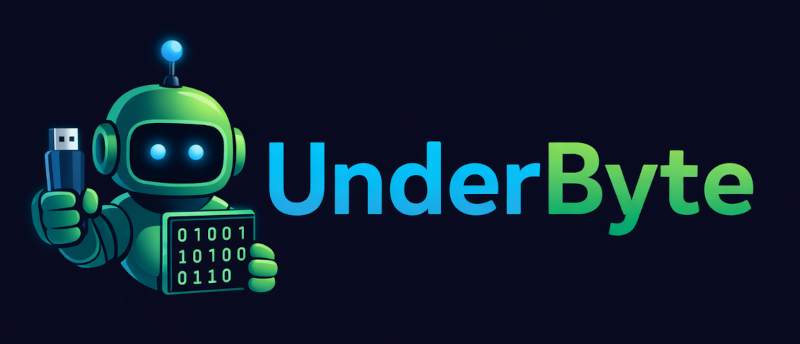

# UnderByte

<div align="center">
  
</div>

**LSB Steganography Web Application**

UnderByte is a web-based tool for hiding messages and files inside images using
Least Significant Bit (LSB) steganography. Encode text or files into lossless
image formats with optional password encryption.

## Features

- **Encode & Decode**: Hide text messages or files within images
- **Password Protection**: Optional XOR encryption for your hidden data
- **Multiple Formats**: Supports PNG, WebP, GIF, BMP, TIFF, APNG, and more
- **Adjustable Bit Depth**: Control visibility vs capacity (1-4 bits per
  channel)
- **Real-time Statistics**: View LSB distribution and modification statistics

## Getting Started

### Prerequisites

- [Deno](https://docs.deno.com/runtime/getting_started/installation) installed

### Development

```bash
deno task dev
```

The application will be available at `http://localhost:5173`

### Build

```bash
deno task build
deno task start
```

## Usage

1. Upload an image (lossless formats recommended)
2. Choose Encode or Decode
3. For encoding: Enter your message or select a file, optionally set a password
4. For decoding: Enter the password if used during encoding
5. Download your encoded image or extracted data

## Future Plans

- **Lossy Format Support**: Add steganography support for JPEG and other lossy
  formats using DCT (Discrete Cosine Transform) domain embedding, allowing data
  to survive re-compression

## Technical Details

Built with:

- [Fresh](https://fresh.deno.dev/) - Deno web framework
- [@cross/image](https://jsr.io/@cross/image) - Pure JavaScript image processing
- Preact & Signals - Reactive UI framework
